# d3script
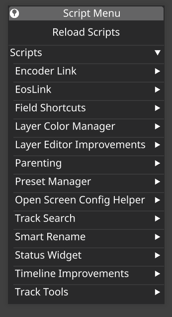
This is an unofficial scripting framework for external scripts in the d3/disguise media server.  Included is a loading mechanism, a menu UI, and a "standard library" of useful calls.  This project is completely unsupported by Disguise and myself and sure to get support to throw your ticket in the trash.  I recommend pairing it with a Streamdeck (or Loupedeck etc) and Bitfocus Companion to give yourself physical buttons to trigger scripts (see included sample Companion config).  I update this repo periodically as I make new scripts and improvements, but there is no formal release schedule or versioning.  There also many assumptions in the scripts provided.  For example, a script may require an existing layer with a specific name, etc.  Its always good to read the code looking for gotchas, and never use in Production unless you are comfortable owning the consequences.  As a rule, I only run these scripts on Editors, leaving the Director "clean" of my interference.
 

# What d3Script does
- Scans a folder (hardcoded to "./Scripts") for modules (.py files or other more complex modules) and loads what it finds. 

- Processes a required dictionary in each loaded module with the name `SCRIPT_OPTIONS`.  This dictionary specifies min and max compatible versions, and optional initialization and destruction callbacks.  The loader checks for compatible versions and will only proceed if it is compatible.  

- This dictionary also has a "scripts" dictionary which describe available entrypoints.  Each "script" consists of a name, a group (for organizing in the Script Menu widget), a callback function, and an optional binding.  The loader takes each "script", and creates a widget with a collapsible panel for each group, and a button for each script on that panel.  If there is a binding, it also sets up that as well (its a bit of a hack at the moment).  Pressing the button or optional binding triggers the callback function.  That function could either do work or open another widget, depending on the scripter's goals.

- The loader also adds a "Scripts" Widget to the top right of the UI, pinned open by default. There is also an option to "Reload Scripts" on the Scripts Menu widget.  Pressing that calls the destructor callback on existing script modules, and rescans the scripts folder for new script modules, and reloads existing script modules.

- Provides a set of utility functions that are useful in making scripts for D3, such as getting the track widget, returning the selected layers in the timeline, etc.

# How to use it
To use, put 'd3script.py' at the root of the project and in the Disguise Python Console (Alt-C) type:
"sys.path.append('./');import d3script",and hit enter.  This will add the project root onto the Python search path, and load the d3script standard library module.

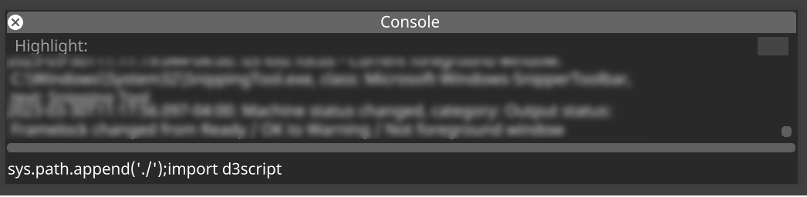

For the included scripts, make a folder in the project root called "scripts".  D3Script will automatically load any files in there when it is iniitially imported.  You can also rescan and reload this folder from the "Scripts" menu.

# What the included scripts do
There are currently fourteen groups of scripts included in this release:

## EncoderLink.py
Provides functions that are useful when combined with an external encoder, like the knobs on a Streamdeck plus.  Look at code and the Companion config for more information.

## EosLink.py
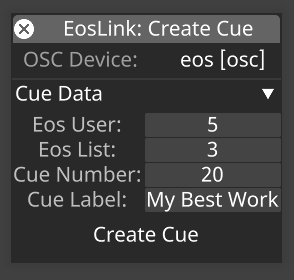
Ability to interact with an Eos lighting console.  Can create, delete, and retrigger cues in an Eos cuelist.  The create and delete widgets populate with the cue (e.g. tag) and label (e.g. note) for the current section.  Requires an OSC device to be setup for Eos.  The first time you run an EosLink script you should choose the OSC device from the dropdown list, and choose the user and cuelist defaults to use.

 

## FieldShortcuts.py

Creates keyboard shortcuts for the most common layer editor properties.  For example, if you have a layer editor open, pressing Ctrl-Shift-t will put keyboard focus on the Brightness field if the property is not animated, or open the keyframe editor for the field if it is animated.  It will also minimize all other field groups.  It's basically an attempt to recreate After Effects style shortcut keys for layer properties.

 

## LayerColorManager.py
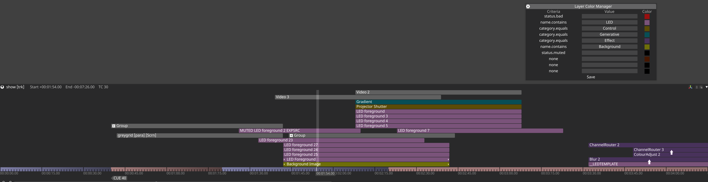
Allows you to control the UI colors of layers on the timeline.  You can set different criteria based on layer name, status, module type, and module category.  Layers are matched based on the order of the criteria, starting at the top option, until a match is found.  THIS IS HIGHLY INVASIVE AND EXPERIMENTAL. I HAVE NOT THOROUGHLY TESTED THIS YET.

 

## LayerEditorImprovements.py
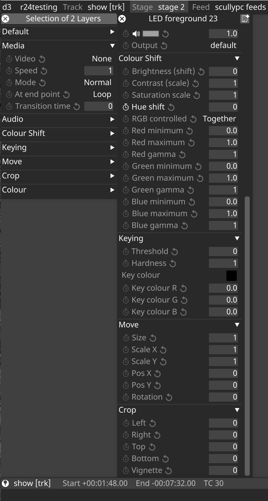
Pins the max height of any open layer editor to the distance between the state bar and the top of the timeline track.  Also, pins the layer editor to the left edge of the screen.  Opening multiple layer editors will tile them out side by side from left to right. THIS IS HIGHLY INVASIVE AND EXPERIMENTAL. I HAVE NOT THOROUGHLY TESTED THIS YET.

 

## Parenting.py
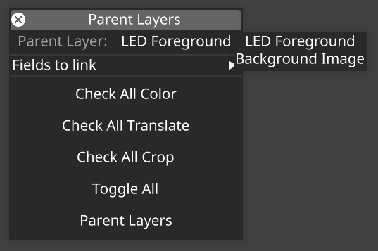
The Parent Layers script lets you automatically create expressions linking from multiple layers(children) to one primary layer(parent).  With multiple layers selected, run the script, and at the top choose a layer to be a parent.  You can then either check specific fields they have in common, or use the buttons to select groups of common layers.  The parent layer will have "EXPSRC" appended to its name since expressioning is currently based on names and will break if the parent is renamed.

 

## PresetManager.py
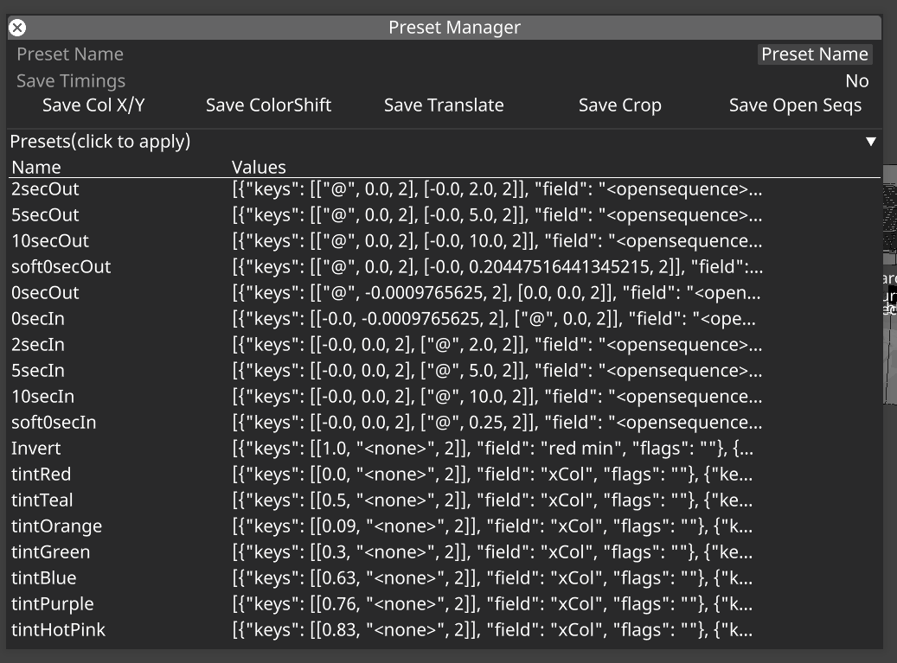
The Preset Manager allows for the saving and recall of any numerical or index based property (e.g. no resources).  You can either use the buttons to save common sets of properties, or instead save the all the open sequences of the current layer editor.  You can also choose whether to save timing information or not.  Presets with timing information will use that timing info to animate properties, and will turn on sequencing on a property if applied to it.  You can right click on a preset to edit, rename, or delete it.  There are also special wildcards(see code) to allow you use the "current", "previous", or "next" value as a keyframe.  There is also a convenience script to allow you to apply presets by name (by connecting it do a streamdeck button, for example).

 

## ScreenConfigHelper.py
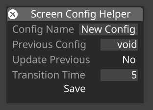
The Screen Config Helper aids in and speeds up the creation of Animate Object presets.  It requires two objects to be created before use: "\_sctenmplate" is a animate object preset config that must contain the objects you want recorded when using the Helper, and "SCENERYMOVER" needs to be a layer in your current timeline where configs will be placed.   

 

## SmartRename.py
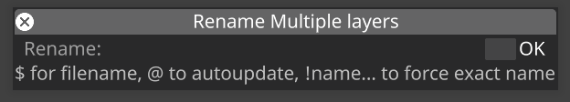
Smart Rename will let you rename a file based on the filename of the media, and automatically appends the module, blendmode, and mapping ("Alpha" as a blendmode and "Video" as a module are not added because I assume them as a default).  This script assumes anything from the first occurance of "\[" onward is automatically updated data and will overwrite that in a name.  This script also will not touch layers with "EXPSRC" in the name as it assumes that layer is the source of an expression link and will be broken by renaming it.

 

## StatusWidget.py
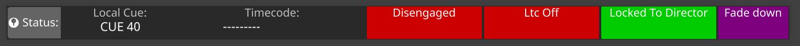
Creates a one-stop-shop for status, including Up/Down/Hold status, transport Engaged status, Editor Locked/Independent status, and LTC status.  Also creates keyboard shortcuts and callable functions to manipulate those settings.
 
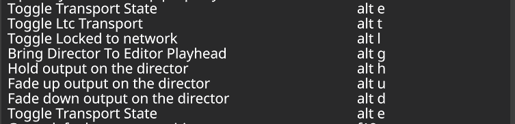

 

## TimelineImprovements.py
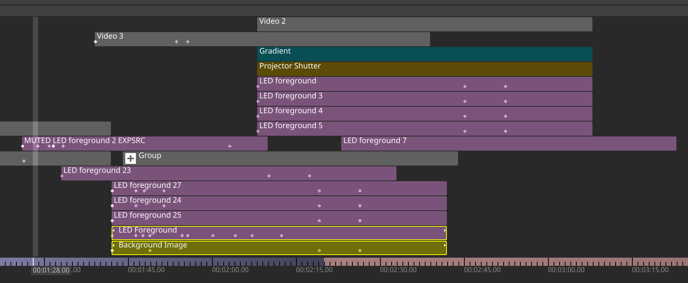
Partially overrides the drawing of the track/timeline in order to add markers on layers to indicate the location of keyframes (if any) for that layer.  Also changes the "selected layer" drawing to instead be a bright yellow outline because I find the UI conventions between "selected layer" and "layer with editor opened" to be confusing.  THIS IS HIGHLY INVASIVE AND EXPERIMENTAL. I HAVE NOT THOROUGHLY TESTED THIS YET. 

 

## TrackSearch.py
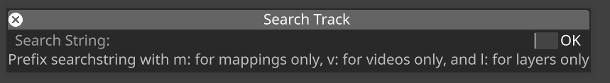
Allows the user to search the track for videos, mappings, and layers that contain the given text.  You can filter the search by using one of the indicated prefixes.  Search results let you click on a found occurance and the timeline will jump to that occurance.  

 

## TrackTools.py
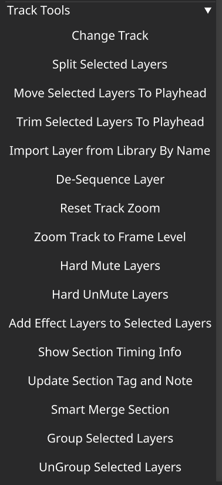
Track tools provide scripts to Duplicate, Split, Trim, and Move selected layers relative to the position of the playhead.  It also provides the ability to note/tag a section with the playhead at any point in that section, as well as the ability to tell you Section Timing Info.  It also provides the ability to import a Layer from the Layer Library by name. Combining this with the d3script.callScript() function lets you, say, create a key on a Streamdeck which will import a specific layer or group of layers onto the timeline.  I use this often when I see patterns of layers being used - such as file sets that always get played together ("There's a channel 1 and 2 to play...", or sometimes I'll have a hotkey that adds a layer with a "blob" that I can use to mask/shape content.  This file also provides a function to de-sequence all fields on selected layers, useful if you are upgrading an older show file where you have fields with 1 or 0 keyframes that you want desequenced.  Additionally, there is a "Smart Merge Section" option that lets you merge the current section and deletes the cue tag and note at the head of the section being merged.

 

# Combining with a control surface
You can use these scripts either by the keyboard shortcuts they define, or by clicking on a button in the scripts menu.  You can also call them remotely.  To do that, set a "telnetConsolePort" in Machine Settings.  This will allow you to connect via TCP/telnet. From there, call the following to trigger a script.
> d3script.callScript(*filenameinquoteswithoutpy*,*functionnameinquotes*,*optionalstringparameterinquotes*)

That function also supports an optional string parameter if the function requires a value to be passed to it, like 
> d3script.callScript('TrackTools','importLayerByName','MyLayer')

I use a streamdeck with Bitfocus Companion, which can send string commands over telnet.

# Warnings and Known Issues
- You'd be crazy to use these in production.  But I do, so......
- Like I said above, you will probably get the stink eye from support if you are using these.  I only ever load themn onto an editor machine to reduce the surface area of possible problems.  Generally, the things that manipulate the gui (like the fieldshortcuts) are safer than scripts that manipulate data (like the renamer or track tools).  
- The interface, functions, and methods that make up 'd3script' are not stable and may change from release to release.  I also don't have a release schedule or versioning system yet, so good luck with that.
- Sometimes to get the keyboard shortcuts to work after an initial load, I need to click into the background of the gui.  Need to fix that.
- SOmetimes the "Scripts" menu button disappears.  Typing "d3script.load_scripts()" into the console will restore it.

# Todo
- Create a context menu for each script button to allow for inspection of binding, etc.
- Solve binding issue
- Move OSC functions into library
- Remove unnecessary imports from scripts
- Implement real version controls and release process

Created by Dan Scully (with copious amounts of copy and paste from others)
dan@danscully.com
